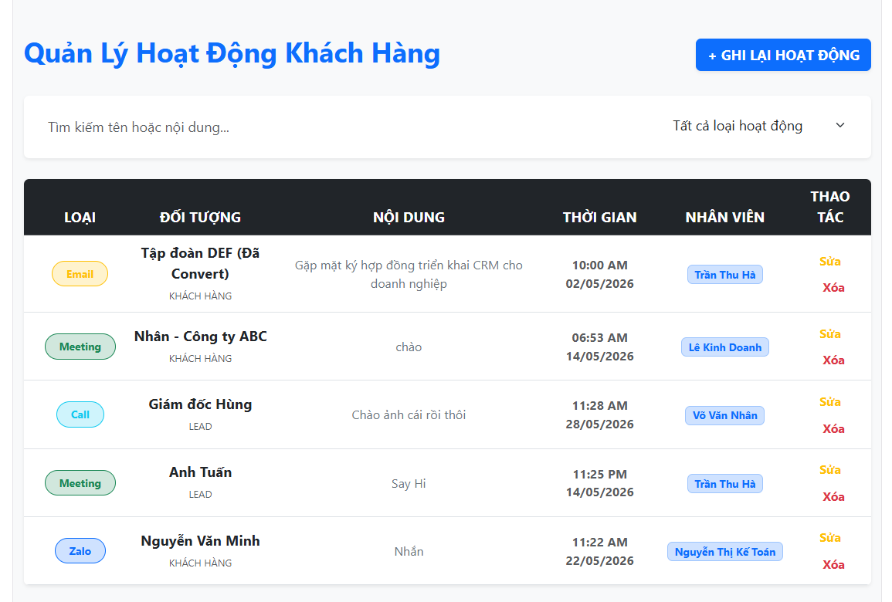
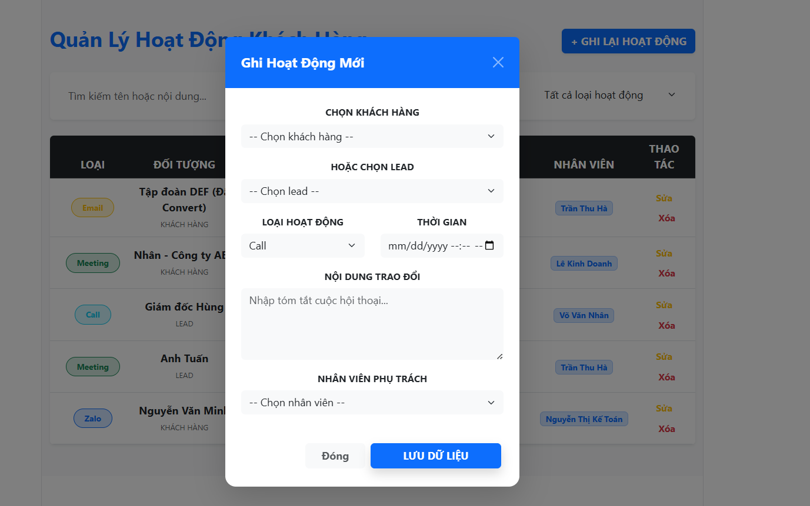
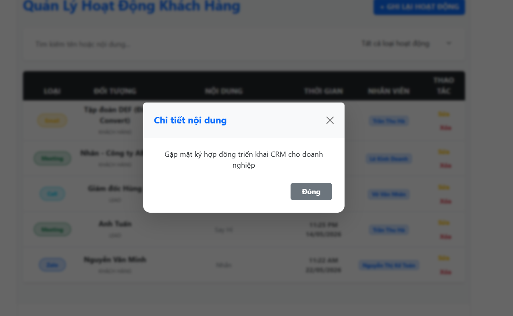

# CRM Online

Hệ thống quản lý hoạt động khách hàng được xây dựng theo kiến trúc Clean Architecture và Domain-Driven Design (DDD).

---

# Yêu Cầu Hệ Thống

Trước khi bắt đầu, hãy đảm bảo máy đã cài đặt:

- JDK 21 hoặc JDK 25
- Node.js (phiên bản mới nhất)
- MySQL Server
- IntelliJ IDEA hoặc VS Code

---

# Demo Giao Diện

## Dashboard

<p align="center">
  
</p>

---

## Form Thêm Dữ Liệu

<p align="center">
  
</p>

---

## Chi Tiết Nội Dung

<p align="center">
  
</p>
# Quy Trình Cài Đặt

## Bước 1: Chuẩn Bị Cơ Sở Dữ Liệu (MySQL)

Mở công cụ quản lý MySQL:

- MySQL Workbench
- Navicat
- CMD

Tạo database mới:

```sql
CREATE DATABASE CRMOnline_Pro;
```

Sau đó:

- để Hibernate tự động generate bảng từ Entity

---

## Bước 2: Cấu Hình Và Chạy Backend (Spring Boot)

Di chuyển vào thư mục:

```bash
cd demo
```

Mở file:

```text
src/main/resources/application.yaml
```

Cập nhật thông tin Database:

```yaml
spring:
  datasource:
    url: jdbc:mysql://localhost:3306/CRMOnline_Pro
    username: root
    password: your_password
```

Mở Terminal tại thư mục `demo/` và chạy:

```bash
mvn clean install
mvn spring-boot:run
```

Backend sẽ chạy tại:

```text
http://localhost:8081/demo
```

---

## Bước 3: Cấu Hình Và Chạy Frontend (React)

Di chuyển vào thư mục:

```bash
cd frontend
```

Cài đặt dependencies:

```bash
npm install
```

Chạy ứng dụng:

```bash
npm run dev
```

Frontend sẽ chạy tại:

```text
http://localhost:5173
```

---

## Bước 4: Kiểm Tra Kết Nối CORS

Đảm bảo file `WebConfig.java` đã cho phép Frontend truy cập Backend:

```java
registry.addMapping("/api/**")
        .allowedOrigins("http://localhost:5173")
        .allowedMethods("GET", "POST", "PUT", "DELETE", "OPTIONS");
```

Nếu chưa cấu hình CORS đúng, hệ thống có thể bị lỗi:

```text
403 Forbidden
```

---

# Hướng Dẫn Sử Dụng Nhanh

| Tính năng        | Cách thực hiện                                            |
| ---------------- | --------------------------------------------------------- |
| Xem danh sách    | Dữ liệu tự động tải khi mở Dashboard                      |
| Ghi hoạt động    | Nhấn `+ Ghi lại hoạt động` và chọn khách hàng / nhân viên |
| Tìm kiếm / Lọc   | Nhập tên khách hàng hoặc chọn loại hoạt động              |
| Xem nội dung dài | Nhấn vào nội dung để mở Modal chi tiết                    |
| Cập nhật giờ     | Nhấn `Sửa` và chọn lại thời gian                          |

---

# Cấu Trúc Thư Mục Dự Án

## Backend

```text
demo/
└── src/
    └── main/
        └── java/
            └── com/
                └── DDD/
                    └── demo/
                        ├── domain/
                        ├── use_cases/
                        └── infrastructure/
```

### Giải thích

- `domain/`
  - Chứa Entity
  - Business Logic
  - Domain Model

- `use_cases/`
  - Chứa các nghiệp vụ xử lý
  - CRUD
  - Application Service

- `infrastructure/`
  - Controller
  - Repository
  - JPA
  - Config hệ thống

---

## Frontend

```text
frontend/
└── src/
    └── App.jsx
```

### Giải thích

- `App.jsx`
  - Chứa giao diện chính
  - Logic xử lý người dùng
  - Kết nối API Backend

---

# Công Nghệ Sử Dụng

## Backend

- Java
- Spring Boot
- Spring Data JPA
- Hibernate
- MySQL
- Maven

## Frontend

- ReactJS
- Vite
- Axios

---

# Kiến Trúc Dự Án

Dự án áp dụng:

- Clean Architecture
- Domain-Driven Design (DDD)
- RESTful API
- Layered Architecture

---

# Cách Chạy Nhanh Toàn Bộ Dự Án

## Terminal 1 - Backend

```bash
cd demo
mvn spring-boot:run
```

## Terminal 2 - Frontend

```bash
cd frontend
npm run dev
```

---

# Lưu Ý

- Đảm bảo MySQL đang hoạt động trước khi chạy Backend
- Kiểm tra đúng username/password Database
- Không được trùng port:
  - Backend: `8081`
  - Frontend: `5173`

```text
Project nghiên cứu Clean Architecture & DDD bằng Spring Boot + ReactJS
```
